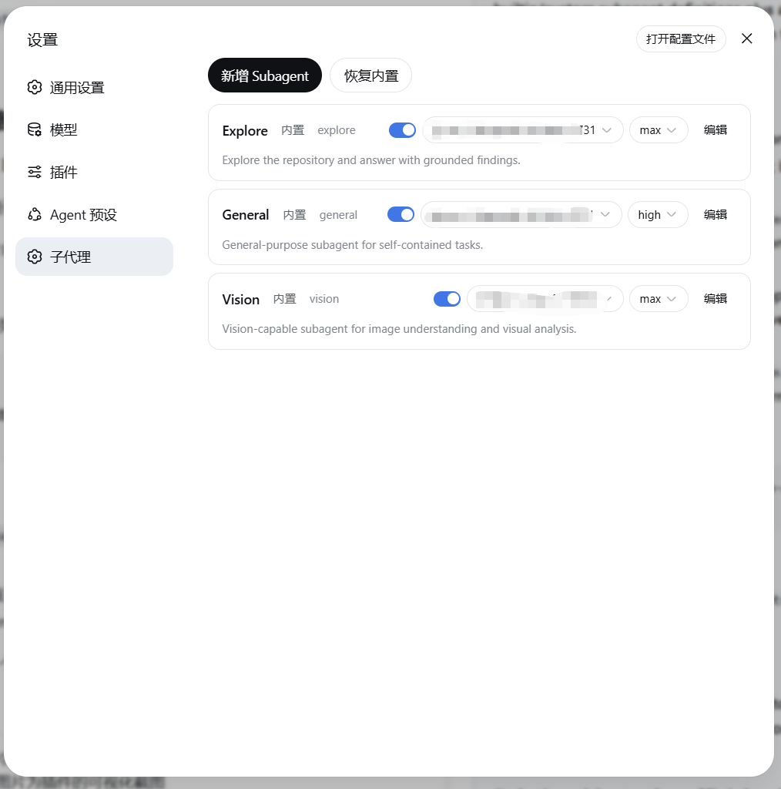

# @konals/dsh-subagents

DSH Subagent 配置管理插件：在设置中维护内置/自定义 Subagent，并通过
`subagent_profile` 工具接入 Harness 原生 `ctx.subagents` spawn/fork 体系。



## 功能

- 内置 Subagent：Explore、General、Vision。
- 可新增/编辑/删除自定义 Subagent；内置项可编辑但不可删除。
- 每个 Subagent 可维护模型、thinking variant（`reasoningEffort`）、persona、
  默认任务模板、工具过滤、maxTokens、maxDepth、后台模式。
- 单个 `subagent_profile` 工具带可选 `profile` 参数；不传 profile 时等价于官方
  `subagent` 工具。
- 可选 `imagePath` 参数：传入图片路径后，子 Agent 会先被要求调用 `read_image`
  读取图片，让多模态模型（如 Vision）真正“看到”图片。
- 子 Agent 与官方工具使用同一 `spawn`/`fork` provider，因此会出现在正常
  subagent 列表面板中。

## 安装

### 本地开发（从代码目录安装）

`<仓库路径>` 是**本机文件系统路径**，不是 GitHub 地址。

```bash
dsh plugin --profile web add link:D:/path/to/dsh-subagents
# 重启 dsh web
```

### 从 npm 安装（发布后）

```bash
dsh plugin --profile web add @konals/dsh-subagents
# 重启 dsh web
```

## 存储

配置保存在 `~/.dsh/dsh-subagents.json`（原子写，0600）。

## 设置

打开 设置 > 子代理。可编辑内置/自定义 Subagent、新增自定义项、删除自定义项、
恢复缺失的内置项。

## 与官方 subagent 工具的关系

官方 `subagent` 工具保持安装。`subagent_profile` 是同一 `ctx.subagents`
spawn/fork provider 的另一个入口；两者产生的子 Agent 都是普通 subagent 会话，
显示在 UI subagent 树中。

## 安全

所有 `/api/dsh-subagents/*` 路由仅 loopback 可访问。JSON 文件为本机用户文件，
不存储任何密钥。
